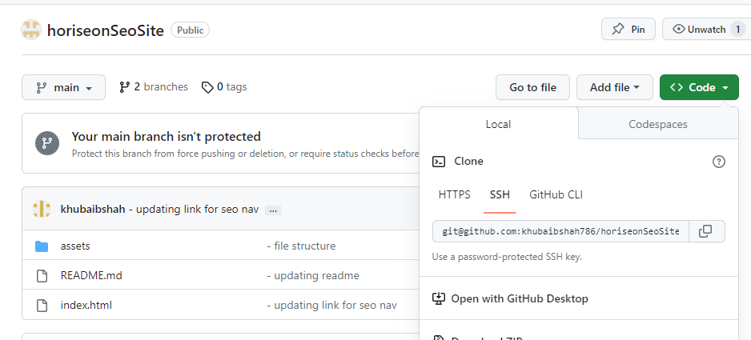

# Horiseon Site

## The Repository

This Respository (`'horiseonSeoSite'`) is where a customer have access to Social Solution Services by Horiseon for Search Engine Optimization (SEO), Online Reputation Managment and social media marketing as a service, the Source code is avaliable to everyone under the standard [MIT license](https://github.com/microsoft/vscode/blob/main/LICENSE.txt).

The purpose of refactoring this project was to make the website more Accessability friendly so the site is optimized for search engines.

As part of the refactoring process the code was not wrote in a concise and easy to understand format. The code required to be formatted and compressed to allow for compact code and to be understood easily. The navigation link for `'Search Engine Optimisation'` was not working as it had no ID attached to it. also there was no semantics added to the code as this allow individuals who make use of screen readers the ability to read the text.

There was no alt tags on any of the images, again these have been added for the purpose of screen readers.

The CSS was also changed as there were alot of classes with the same properties, these were changed to combine all those which have the same properties, reducing the lines of code and making it more concise.

Comments were also added to the Css where the combination of classes has been updated and generic comments for all the other classes to understand what they have also been added.

## Changes made

- changes to the styling sheet, combining some classes to reduce code size
- adding semantics to html file e.g nav, footer, article etc.
- adding id to search engine section to allow naviagtion to work
- adding comments to Css file to explain what each class does
- changing title text for screenreaders
- adding alt text to each image for screen readers
- adding comments to the Html file
- updating the Readme file to explain what has been changed, including screenshot, credits.

## Table of Contents (Optional)

If your README is very long, add a table of contents to make it easy for users to find what they need.

- [Installation](#installation)
- [Usage](#usage)
- [Credits](#credits)
- [License](#license)

## Links

- Link to Github Repository - https://github.com/khubaibshah786/horiseonSeoSite
- Live view of the webpage using Github pages feature -
  https://khubaibshah786.github.io/horiseonSeoSite/

## Installation

1. Firstly clone the project from Github into your local machine.
2. Once you have successfully cloned the project, open the project in a IDE of your choice.
3. Finally open the `Index.html` file and run it in the browser of your choice, and you will successfully have the website running!

## Usage

### How to install from Github

- Link to Github Repository - https://github.com/khubaibshah786/horiseonSeoSite
- Click the SSH, Github Cli or HTTPS based on your cofiguration and then copy the link to clone.
  
- Once you have the copied link in your clip board, run a git command to clone the project, (`screenshot below`).

  

- Once you have cloned the project in the IDE of your choice, left click on the `index.html` file and click open in default browser (`This example shows how it would be configured using VScode`).

- Once you have opened the `index.html` in the browser you should see the site load as follows:
  
  

## Credits

Tutorial followed to add Semantic to the `Index.html` file for accessability purposes

- https://www.w3schools.com/html/html5_semantic_elements.asp

## License

the Source code is avaliable to everyone under the standard [MIT license](https://github.com/microsoft/vscode/blob/main/LICENSE.txt).

## Badges

## Features

### Navigation Options - `features`

- Allowing user to navigate through the static site using the naviagtion options.

## Contributing

No contributions needed

© 2023 edX Boot Camps LLC. Confidential and Proprietary. All Rights Reserved.
